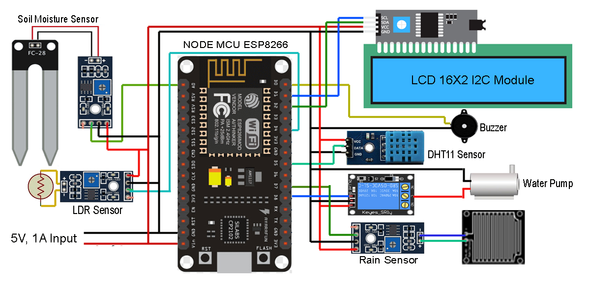

# AgroSense: An IoT & AI-Powered Smart Farming Showcase


This repository contains the source code for **AgroSense**, a web-based showcase for the research project, "A Brief Review on Smart Farming Technologies for Precision Agriculture"[cite: 179]. The project integrates a physical IoT hardware prototype with a modern, interactive web application to demonstrate the core principles of smart farming.


**Live Demo:** [**https://agrosense-c9cfa.web.app**](https://agrosense-c9cfa.web.app)


---


## 📋 Table of Contents

- [Overview](#-overview)

- [Key Features](#-key-features)

- [Hardware & Circuit Diagram](#-hardware--circuit-diagram)

- [Software & Technology Stack](#-software--technology-stack)

- [Project Setup](#-project-setup)

- [The Research Team](#-the-research-team)

- [Acknowledgments](#-acknowledgments)


---


## 🔎 Overview


AgroSense is a comprehensive project that reviews and demonstrates how modern technologies can revolutionize farming. [cite_start]It explores the use of the Internet of Things (IoT) for real-time data collection and Artificial Intelligence (AI) for interactive user engagement.The goal is to create a practical, low-cost smart farming system that empowers users with live data for better farm management, addressing the food demands of a growing global population by improving agricultural efficiency and sustainability.


The web platform serves as an interactive front-end to present this research, making the concepts accessible and understandable through practical demonstrations like a real-time data dashboard and an intelligent chatbot.


---


## ✨ Key Features


* **Responsive Web Interface:** A single-page application built with HTML, CSS, and JavaScript that is fully responsive on all devices.

* **Live IoT Dashboard:** Features a link to a live dashboard designed to display real-time sensor data from a connected hardware prototype.The dashboard monitors crucial environmental data, including humidity, water levels, rainfall detection, and day/night cycles.

* **AI-Powered Chatbot:** Integrated with the **Google Gemini API**, the chatbot provides interactive information and answers user queries specifically about the research project and its findings.

* **Automatic Irrigation Control:** The system includes logic to automatically control a water pump based on real-time soil moisture readings.

* **Light/Dark Theme:** A modern UI with a theme toggle for a better user experience.

* **Globally Deployed:** The showcase website is deployed using **Firebase Hosting** for high availability and performance.


---


## 🔧 Hardware & Circuit Diagram


The core of the project is an IoT device built with a central microcontroller connected to a suite of sensors.


### Components Used

* **Microcontroller:** NodeMCU ESP8266 (Wi-Fi enabled)[cite: 1, 14, 16].

* **Sensors:**

    * DHT11 Sensor (Temperature & Humidity).

    * Soil Moisture Sensor (FC-28).

    * Rain Sensor Module.

    * LDR Sensor (Photoresistor for light detection).

* **Actuators & Display:**

    * 5V Relay Module (for controlling the water pump).

    * 16x2 I2C LCD Display (for status updates).

    * Buzzer (for alerts).


### Circuit Diagram




---


## 💻 Software & Technology Stack


* **Firmware:** Written in **C++** on the **Arduino IDE** for the NodeMCU ESP8266[cite: 74].

* **Frontend:** HTML5, CSS3, JavaScript (ES6)

* **AI / APIs:** Google Gemini API

* **Deployment:** Firebase Hosting


---


## 🚀 Project Setup


To run this project locally:


1.  **Clone the repository:**

    ```bash

    git clone [https://github.com/r8rishav/smartfarming.git](https://github.com/r8rishav/smartfarming.git)

    ```

2.  **Navigate to the project directory:**

    ```bash

    cd smartfarming

    ```

3.  **Set up the API Key:**

    * Open the `public/script.js` file.

    * Find the line `const API_KEY = "YOUR_GEMINI_API_KEY";` and replace the placeholder with your actual Google Gemini API key.


4.  **Run the project:**

    * The easiest way is to use the **Live Server** extension in VS Code. Right-click on `public/index.html` and select "Open with Live Server".


---


## 👥 The Research Team


This project was developed by the following students from the **Institute of Engineering & Management, Kolkata**[cite: 180]:


* Rishav Raj

* Amar Pal

* Arijit Ghosh


---


## 🙏 Acknowledgments


This project was completed under the valuable guidance of our mentors and project supervisors.


* Mr. Soumik Kumar Kundu

* Mr. Samit Karmakar
