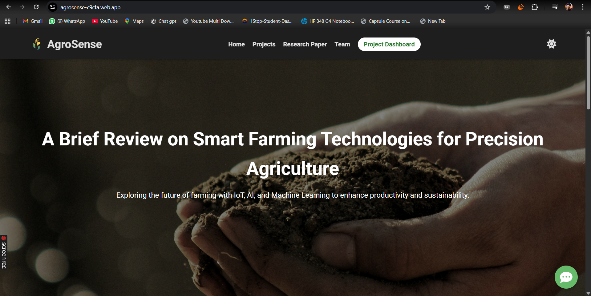
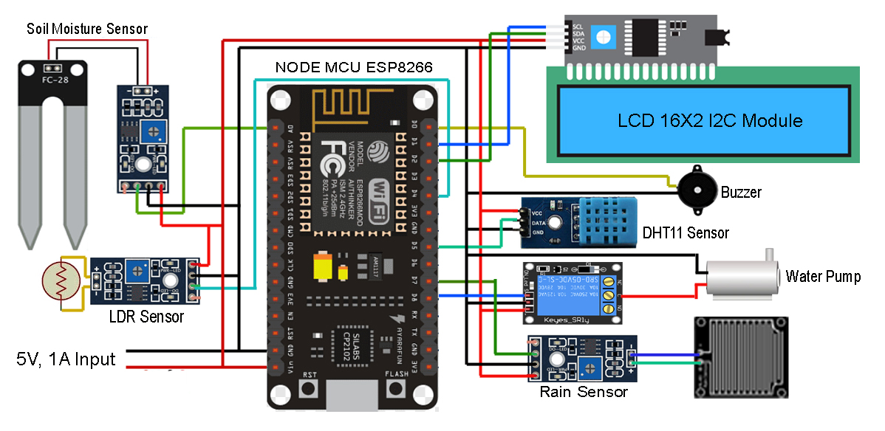

# AgroSense: An IoT & AI-Powered Smart Farming Showcase





This repository contains the source code for **AgroSense**, a web-based showcase for the research project, "A Brief Review on Smart Farming Technologies for Precision Agriculture"[cite: 179]. The project integrates a physical IoT hardware prototype with a modern, interactive web application to demonstrate the core principles of smart farming.


**Live Demo:** [**https://agrosense-c9cfa.web.app**](https://agrosense-c9cfa.web.app)


---


## 📋 Table of Contents

- [Overview](#-overview)

- [Key Features](#-key-features)

- [Hardware & Circuit Diagram](#-hardware--circuit-diagram)

- [Software & Technology Stack](#-software--technology-stack)

- [Project Setup](#-project-setup)

- [The Research Team](#-the-research-team)

- [Acknowledgments](#-acknowledgments)


---


## 🔎 Overview


AgroSense is a comprehensive project that reviews and demonstrates how modern technologies can revolutionize farming. [cite_start]It explores the use of the Internet of Things (IoT) for real-time data collection and Artificial Intelligence (AI) for interactive user engagement.The goal is to create a practical, low-cost smart farming system that empowers users with live data for better farm management, addressing the food demands of a growing global population by improving agricultural efficiency and sustainability.


The web platform serves as an interactive front-end to present this research, making the concepts accessible and understandable through practical demonstrations like a real-time data dashboard and an intelligent chatbot.


---


## ✨ Key Features


* **Responsive Web Interface:** A single-page application built with HTML, CSS, and JavaScript that is fully responsive on all devices.

* **Live IoT Dashboard:** Features a link to a live dashboard designed to display real-time sensor data from a connected hardware prototype.The dashboard monitors crucial environmental data, including humidity, water levels, rainfall detection, and day/night cycles.

* **AI-Powered Chatbot:** Integrated with the **Google Gemini API**, the chatbot provides interactive information and answers user queries specifically about the research project and its findings.

* **Automatic Irrigation Control:** The system includes logic to automatically control a water pump based on real-time soil moisture readings.

* **Light/Dark Theme:** A modern UI with a theme toggle for a better user experience.

* **Globally Deployed:** The showcase website is deployed using **Firebase Hosting** for high availability and performance.


---


## 🔧 Hardware & Circuit Diagram


The core of the project is an IoT device built with a central microcontroller connected to a suite of sensors.


### Components Used

* **Microcontroller:** NodeMCU ESP8266 (Wi-Fi enabled)[cite: 1, 14, 16].

* **Sensors:**

    * DHT11 Sensor (Temperature & Humidity).

    * Soil Moisture Sensor (FC-28).

    * Rain Sensor Module.

    * LDR Sensor (Photoresistor for light detection).

* **Actuators & Display:**

    * 5V Relay Module (for controlling the water pump).

    * 16x2 I2C LCD Display (for status updates).

    * Buzzer (for alerts).


### Circuit Diagram




---


## 💻 Software & Technology Stack


* **Firmware:** Written in **C++** on the **Arduino IDE** for the NodeMCU ESP8266[cite: 74].

* **Frontend:** HTML5, CSS3, JavaScript (ES6)

* **AI / APIs:** Google Gemini API

* **Deployment:** Firebase Hosting


---


## 🚀 Project Setup


To run this project locally:


1.  **Clone the repository:**

    ```bash

    git clone [https://github.com/r8rishav/smartfarming.git](https://github.com/r8rishav/smartfarming.git)

    ```

2.  **Navigate to the project directory:**

    ```bash

    cd smartfarming

    ```

3.  **Set up the API Key:**

    * Open the `public/script.js` file.

    * Find the line `const API_KEY = "YOUR_GEMINI_API_KEY";` and replace the placeholder with your actual Google Gemini API key.


4.  **Run the project:**

    * The easiest way is to use the **Live Server** extension in VS Code. Right-click on `public/index.html` and select "Open with Live Server".


---


## 👥 The Research Team


This project was developed by the following students from the **Institute of Engineering & Management, Kolkata**[cite: 180]:


* Rishav Raj

* Amar Pal

* Arijit Ghosh


---


## 🙏 Acknowledgments


This project was completed under the valuable guidance of our mentors and project supervisors.


* Mr. Soumik Kumar Kundu

* Mr. Samit Karmakar


## 🤖 Crop Recommendation ML API

The website includes a Python backend (`backend/app.py`) that loads your crop dataset, trains a `RandomForestClassifier`, and serves predictions to the frontend form.

### Run locally (frontend + ML API)

1. **Clone the repository and enter it:**
   ```bash
   git clone https://github.com/<your-username>/smartfarming.git
   cd smartfarming
   ```
2. **Prepare and start backend API:**
   ```bash
   python3 -m venv .venv
   source .venv/bin/activate
   pip install -r backend/requirements.txt
   ```
3. **Provide dataset CSV:**
   - Preferred path: `backend/data/Crop_recommendation.csv`
   - Or set an environment variable:
     ```bash
     export CROP_DATASET_PATH=/absolute/path/to/Crop_recommendation.csv
     ```
4. **Run the backend server:**
   ```bash
   python backend/app.py
   ```
   The API runs at `http://localhost:8000`.

5. **Run frontend in another terminal:**
   ```bash
   python -m http.server 4173 --directory public
   ```
   Open `http://localhost:4173` and test the Crop Recommendation form.

---

## 🌍 Can I host everything on GitHub?

Short answer: **GitHub Pages can host only static frontend files**. Your ML backend (Flask + scikit-learn) must run on a backend host.

### Recommended deployment split

- **Frontend (`public/*`)** → GitHub Pages
- **Backend (`backend/app.py`)** → Render / Railway / Fly.io / any Python host

### A) Deploy frontend on GitHub Pages

1. Push the repository to GitHub.
2. In GitHub, go to **Settings → Pages**.
3. Set source to:
   - **Deploy from a branch**
   - Branch: `main` (or your default branch)
   - Folder: `/public`
4. Save and wait for deployment.
5. Your frontend URL will be like:
   `https://<username>.github.io/smartfarming/`

### B) Deploy backend (example: Render)

1. Create a new **Web Service** on Render and connect this repo.
2. Configure:
   - **Root Directory:** `backend`
   - **Build Command:** `pip install -r requirements.txt`
   - **Start Command:** `python app.py`
3. Add environment variable (if dataset path is custom):
   - `CROP_DATASET_PATH=/opt/render/project/src/backend/data/Crop_recommendation.csv`
4. Deploy and copy backend URL, e.g. `https://smartfarming-api.onrender.com`

### C) Connect frontend to deployed backend

Before `public/script.js` is loaded, define:

```html
<script>
  window.CROP_API_BASE = "https://smartfarming-api.onrender.com";
</script>
```

Then deploy frontend again. Crop predictions will use your hosted API.

### API endpoints

- `GET /api/health`
- `POST /api/predict-crop`

Example `POST` payload:

```json
{
  "temperature": 35.0,
  "humidity": 80.0,
  "ph": 6.5,
  "water_availability": 155.0,
  "season": "winter"
}
```

## 🚀 Go live (recommended: Firebase + Render)

If your goal is to make the site publicly accessible quickly, use this production setup:

- **Frontend (this website)** → Firebase Hosting
- **ML Backend (`backend/app.py`)** → Render Web Service

### 1) Deploy backend to Render

1. Push your repo to GitHub.
2. In Render, create **New Web Service** from this repo.
3. Use these settings:
   - **Root Directory:** `backend`
   - **Build Command:** `pip install -r requirements.txt`
   - **Start Command:** `python app.py`
4. Make sure your dataset exists at `backend/data/Crop_recommendation.csv` in the repo,
   or set `CROP_DATASET_PATH` in Render environment variables.
5. After deploy, copy URL (example):
   `https://smartfarming-api.onrender.com`

### 2) Point frontend to backend URL

In `public/index.html`, add this **before** loading `script.js`:

```html
<script>
  window.CROP_API_BASE = "https://smartfarming-api.onrender.com";
</script>
```

### 3) Deploy frontend to Firebase Hosting

From project root:

```bash
npm install -g firebase-tools
firebase login
firebase init hosting
# choose existing project or create one
# public directory: public
# single-page app rewrite: Yes
firebase deploy
```

Firebase will return your live URL, for example:
`https://your-project-id.web.app`

### 4) Verify production endpoints

- Open your live website and submit the Crop form.
- Directly test backend health:

```bash
curl https://smartfarming-api.onrender.com/api/health
```

If the health endpoint works and the form predicts crops, your site is fully live.

## 🧭 Publish to your GitHub first (step-by-step)

I cannot directly log in to your GitHub account from this environment, but you can publish in 3 minutes with these commands:

```bash
git status
git remote remove origin 2>/dev/null || true
git remote add origin https://github.com/<your-username>/smartfarming.git
git push -u origin main
```

After push, this repo includes a GitHub Actions workflow at `.github/workflows/deploy-pages.yml` that deploys the `public/` folder to GitHub Pages automatically on every push to `main`.

### Turn on GitHub Pages in repository settings

1. Open your GitHub repo → **Settings** → **Pages**.
2. Under **Build and deployment**, choose **Source: GitHub Actions**.
3. Push to `main` (or run the workflow manually from the **Actions** tab).
4. Your live frontend URL will be:
   - `https://<your-username>.github.io/smartfarming/`

> Note: this publishes only the frontend. The ML Flask backend must be hosted separately (Render/Railway/Fly/etc.) and connected with `window.CROP_API_BASE`.

